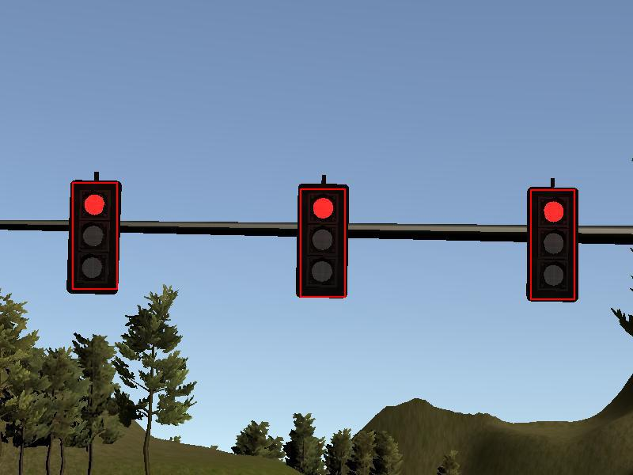
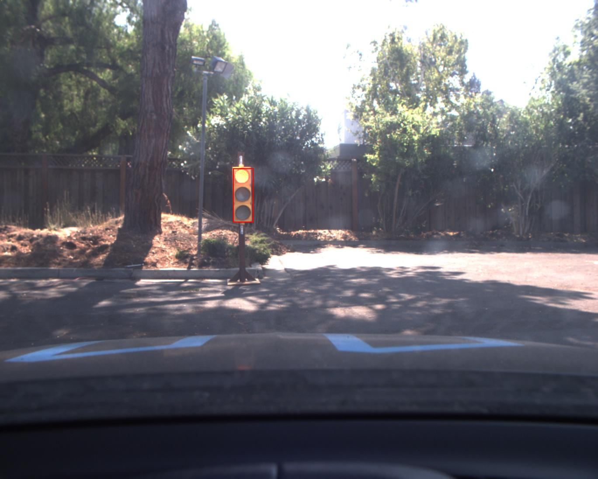

# Programming a Real Self-Driving Car


This is the project repo for the final project of the Udacity Self-Driving Car Nanodegree: Programming a Real Self-Driving Car.

The goal of this project is to write ROS nodes to implement core functionality of the autonomous vehicle system, including traffic light detection, control, and waypoint following. The code is tested using a simulator and then, the project can be run in a real Self-Driving Car, called Carla.

## Team Members

|               |       Full Name      |          Email         |
|:-------------:|:--------------------:|:----------------------:|
|   Team Lead   | Yaboo Oyabu          | yuki.oyabu@gmail.com   |
| Team Member 1 | Fangming Cao         | fangmingcao@yahoo.com  |
| Team Member 2 | Jose Trescastro Diaz | jotredi@protonmail.com |
| Team Member 3 | Flavio HG            | flavio@edgeuplink.net  |
| Team Member 4 | Antonis Skardasis    | askardasis@gmail.com   |

## System Integration 

The autonomous vehicle system is implemented using ROS nodes and topics. This makes the communication between each node (each functionality) easier and we can easily publish the commands that the vehicle needs to execute as well as read and process data from sensors like the camera.

Each node implements a core functionality of the complete system and they could be classified into **Perception**, **Planning** and **Control**.

The following diagram shows the architecture of the ROS nodes as well as the topics that are being used:


## Perception 

In the Perception part, the car needs to be able to detect and classify obstacles in the environment. Traffic lights are an important obstacle that the vehicle should consider and the one we will focus on this project.

The traffic light detection node reads data from waypoints, camera and current position to publish the location where the car needs to stop for red traffic lights in `/traffic_waypoint`.


### TL detection 

For detecting traffic lights, we have used one of the detection models provided by the [TensorFlow Object Detection API](https://github.com/tensorflow/models/tree/master/research/object_detection) and we have retrained it with images for our application (simulator and car test track).

Concretely, we have used the SSD Inception v2 model. [SSD (Single Shot Detection)]( https://arxiv.org/abs/1512.02325) architecture is commonly used for object detection because is much faster than other networks like *Faster R-CNN* or *YOLO* architectures.

Inference time plays an important role in self driving cars because the detection model needs to run in real time so that the car can react in advance to obstacles (stopping at a red light in this case).

Here is the output for simulator and real world images:

  

### TL Classification

After the traffic lights are detected, we have used a traffic light classification model trained on both simulator and real world images that classifies the state (`GREEN`, `YELLOW` or `RED`) given the output of the detection model (bounding boxes with traffic lights).

Traffic light detection node is implemented in `tl_detector.py`. This python file processes the incoming traffic light data and camera images while the traffic light classification is performed in `tl_classifier.py`.

## Planning

The planning submodule takes care of creating a trajectory that the car should follow given the output of the Perception module as well as the current position and base waypoints.

The main task here is performed by the `Waypoint Updater Node`. This node updates the target velocity of each waypoint based on traffic light and obstacle detection data. So if there is an upcoming red traffic light, this will bring the vehicle to a smooth and full stop.

Finally, this node will publish the final waypoints that the controller will execute:


In real world driving, this Planning module will modify not only the velocity of the vehicle but also the trajectory. For example, if there is an obstacle in our way that is not going to move (like a parked vehicle) we would have to replan a trajectory to avoid that vehicle and continue driving.

## Control 

After the final waypoints are calculated, the drive-by-wire node (`dbw_node.py`) will use various controllers to provide appropiate throttle, brake and steering commands for the vehicle to execute. 

These commands can then be published to the following topics:

* `/vehicle/throttle_cmd`
* `/vehicle/brake_cmd`
* `/vehicle/steering_cmd`


The vehicle control is implemented in `twist_controller.py`. This controller takes twist data as input and returns throttle, brake and steering values.

For acceleration, a PID controller (`pid.py`) is used to generate throttle values as well as a low pass filter (`lowpass.py`) to filter noisy velocity values.

For steering, `yaw_controller.py` is used to convert target linear and angular velocity to steering commands.

---

## Setup instructions

Please use **one** of the two installation options, either native **or** docker installation.

### Native Installation

* Be sure that your workstation is running Ubuntu 16.04 Xenial Xerus or Ubuntu 14.04 Trusty Tahir. [Ubuntu downloads can be found here](https://www.ubuntu.com/download/desktop).
* If using a Virtual Machine to install Ubuntu, use the following configuration as minimum:
  * 2 CPU
  * 2 GB system memory
  * 25 GB of free hard drive space
  
* Follow these instructions to install ROS
  * [ROS Kinetic](http://wiki.ros.org/kinetic/Installation/Ubuntu) if you have Ubuntu 16.04.
  * [ROS Indigo](http://wiki.ros.org/indigo/Installation/Ubuntu) if you have Ubuntu 14.04.
* Download the [Udacity Simulator](https://github.com/udacity/CarND-Capstone/releases).

### Docker Installation
[Install Docker](https://docs.docker.com/engine/installation/)

Build the docker container
```bash
docker build . -t capstone
```

Run the docker file
```bash
docker run -p 4567:4567 -v $PWD:/capstone -v /tmp/log:/root/.ros/ --rm -it capstone
```

### Usage

1. Clone the project repository

2. Install python dependencies
```bash
cd CarND-Capstone
pip install -r requirements.txt
```
3. Make and run styx
```bash
cd ros
catkin_make
source devel/setup.sh
roslaunch launch/styx.launch
```
4. Run the simulator

### Other library/driver information
Outside of `requirements.txt`, here is information on other driver/library versions used in the simulator and Carla:

|        | Simulator | Carla  |
| :-----------: |:-------------:| :-----:|
| Nvidia driver | 384.130 | 384.130 |
| CUDA | 8.0.61 | 8.0.61 |
| cuDNN | 6.0.21 | 6.0.21 |
| TensorRT | N/A | N/A |
| OpenCV | 3.2.0-dev | 2.4.8 |
| OpenMP | N/A | N/A |
